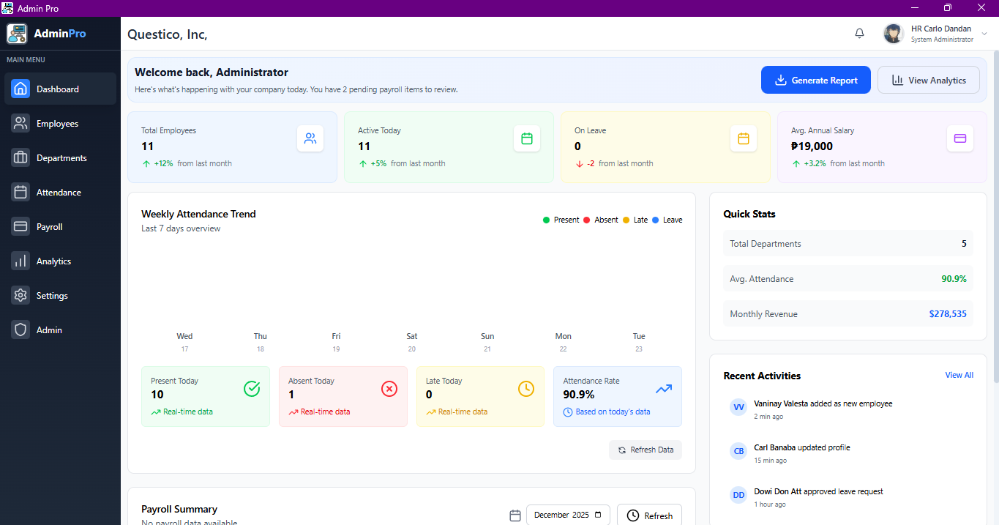

# Admin Pro

> Offline-first company administration system — employees, departments, attendance and
> Philippine bi-monthly payroll.



Admin Pro is a Windows desktop application built with **Tauri 2** (Rust backend, React
frontend). It keeps a local **SQLite** database as the authoritative store, mirrors it to
**Supabase** for backup and multi-device access, and encrypts employee contact details and
PINs at rest in *both* databases under a single key that never touches disk in plaintext.

| | |
|---|---|
| **Platform** | Windows 10 / 11 (x64) |
| **Runtime** | Tauri 2 — Rust core + system WebView2 |
| **Local database** | SQLite via `rusqlite` (bundled SQLite 3.46) |
| **Cloud database** | Supabase (Postgres 17) over the REST/PostgREST API |
| **Credentials** | Supabase GoTrue only — no password hash is ever stored locally |
| **Sync direction** | Local → cloud, with one exception (see below) |
| **Installer** | NSIS, per-user install |

---

## Table of contents

- [Security model at a glance](#security-model-at-a-glance)
- [Features](#features)
- [Prerequisites](#prerequisites)
- [Setup](#setup)
- [Running in development](#running-in-development)
- [Building an installer](#building-an-installer)
- [Building in CI](#building-in-ci)
- [Offline behaviour](#offline-behaviour)
- [Project layout](#project-layout)
- [Documentation](#documentation)
- [Contributing](#contributing)
- [License](#license)

---

## Security model at a glance

The full design, including the threat model and its limits, is in
[`docs/SECURITY.md`](docs/SECURITY.md). The short version:

- **Credentials are cloud-only.** Administrator sign-in goes to Supabase GoTrue. No bcrypt
  hash, no password, and no key file exists on the machine.
- **Authorization lives in the database.** A row in `public.app_admins` — not a JWT claim —
  decides who may read or write. `user_metadata` is user-editable and is never trusted.
- **One data key, generated once.** On registration the app generates a 32-byte AES-256-GCM
  data key and uploads it *wrapped twice*: once under `Argon2id(admin password)` and once
  under a generated 64-character **recovery key**. The database enforces "once" — a second
  attempt is rejected by a single-row constraint, not by client-side logic.
- **The recovery key is displayed exactly once** and is never persisted by the app, in
  either database.
- **Employee `email`, `phone`, `pin_code` and `company_id` are ciphertext at rest** in
  SQLite *and* in Postgres, in the identical `enc:v1:…` form. Encryption is idempotent by
  construction: a value that is already encrypted is returned untouched.
- **Uniqueness survives encryption** through blind indexes — `HMAC-SHA256` of the
  normalised value under a key derived from the data key by HKDF.
- **The anon key in the installer grants nothing.** There is no `anon` policy on any table,
  so extracting it yields `permission denied`, not a filtered-empty result set.
- **Sync is one-way.** Local writes push to the cloud. Cloud edits never come back — except
  on a device whose SQLite file does not yet exist, which seeds itself from the cloud once.

---

## Features

**Employees** — central register of profiles, positions, departments, salaries and status.
Contact details and PINs are encrypted at rest; the administrator UI decrypts on load, so
the interface is unchanged.

**Departments** — company structure with per-department budgets and headcount.

**Attendance**
- *Kiosk mode* — a dedicated full-screen keypad where employees clock in and out with a PIN.
- *Manual entry* — administrator override for corrections.
- *Reporting* — daily, weekly, cut-off and monthly summaries, all CSV-exportable.

**Payroll**
- Philippine bi-monthly cut-offs (1–15, 16–end of month).
- SSS, PhilHealth, Pag-IBIG and withholding-tax computation, plus allowances and ad-hoc
  deductions.
- Payslip figures derived from recorded attendance, not typed in by hand.

**Analytics** — attendance trends, department distribution and payroll cost over time.

**Offline-first** — every screen reads and writes the local SQLite database. Cloud
connectivity affects sign-in and backup, never day-to-day use.

---

## Prerequisites

| Requirement | Version | Notes |
|---|---|---|
| Windows | 10 or 11 (x64) | The bundle target is NSIS; other platforms are untested. |
| Rust | **1.88 or newer** | `rust-version` in `src-tauri/Cargo.toml`. Install via [rustup](https://rustup.rs/). |
| MSVC build tools | Visual Studio 2022 Build Tools with the *Desktop development with C++* workload | Required to link the Rust core and to compile bundled SQLite. |
| WebView2 runtime | Current | Preinstalled on Windows 11 and on up-to-date Windows 10. |
| Node.js | 20 or newer (24.x used here) | Builds the React frontend. |
| pnpm | 10 or newer (11.x used here) | `npm install -g pnpm`, or via Corepack. |
| Supabase project | — | Free tier is sufficient. See [`docs/SUPABASE_SETUP.md`](docs/SUPABASE_SETUP.md). |

> [!NOTE]
> A Rust toolchain is genuinely required — this is not an Electron application, and there is
> no prebuilt native module to download. The first `cargo` build compiles the whole
> dependency tree and takes several minutes; later builds are incremental.

---

## Setup

### 1. Clone and install

```bash
git clone https://github.com/carlodandan/admin-pro.git
cd admin-pro
pnpm install
```

### 2. Prepare the Supabase project

Follow [`docs/SUPABASE_SETUP.md`](docs/SUPABASE_SETUP.md). It covers creating the project,
applying `supabase/migrations/`, and the two authentication settings that registration
depends on.

> [!IMPORTANT]
> Apply the migration **before** first launch. It creates the authorization registry and the
> keyring the application signs in against; without it registration fails.

### 3. Configure the environment

```bash
cp .env.example .env
```

| Variable | Description | Required |
|---|---|---|
| `VITE_SUPABASE_URL` | Project URL, e.g. `https://<ref>.supabase.co` | Yes |
| `VITE_SUPABASE_ANON_KEY` | Publishable / `anon` key | Yes |

Both are inlined into the bundle at build time and are therefore extractable from the
installer. That is expected: the anon key is not a secret and, under the policies this
project ships, authorizes nothing on its own.

> [!CAUTION]
> Never commit `.env`, and never put a `service_role` (secret) key in it. `.env` is already
> in `.gitignore`.

### 4. First run

```bash
pnpm start
```

The first launch shows the **registration** screen. It requires a working connection,
because it creates the cloud administrator account and generates the data key.

Registration produces a **64-character recovery key**, shown once. Copy it into a password
manager before continuing. It is the only way to recover encrypted data if the
administrator password is lost — the application cannot show it again, and neither database
stores it.

---

## Running in development

```bash
pnpm start        # Tauri dev: Vite on :5173 + the Rust core, hot reload on the frontend
pnpm dev          # Vite only, no desktop shell (useful for pure UI work)
pnpm lint         # ESLint over src/renderer
```

Rust-side checks:

```bash
cd src-tauri
cargo clippy --all-targets
cargo test                # unit tests for the crypto module
```

Editing Rust triggers a recompile and relaunch; editing the frontend hot-reloads.

---

## Building an installer

```bash
pnpm make
```

Output:

```
src-tauri/target/release/bundle/nsis/Admin Pro_1.0.0_x64-setup.exe
```

The installer is a per-user NSIS package, so it needs no administrator elevation. Use
`pnpm package` for an unbundled `admin-pro.exe` in `src-tauri/target/release/` when you want
to test the binary without producing an installer.

> [!NOTE]
> **Cross-platform builds.** `src-tauri/tauri.conf.json` targets NSIS, and the offline
> credential cache uses the Windows Credential Manager, so macOS and Linux need both a
> different bundle target and a keychain backend before they will work. See the
> [Tauri distribution guide](https://v2.tauri.app/distribute/).

---

## Building in CI

`.github/workflows/build.yml` builds the installer on a Windows runner and attaches it to a
GitHub release. Add `VITE_SUPABASE_URL` and `VITE_SUPABASE_ANON_KEY` as repository secrets,
then run the workflow from **Actions → Build Admin Pro → Run workflow**.

Setup and the rationale behind each step are in
[`docs/GITHUB_WORKFLOW.md`](docs/GITHUB_WORKFLOW.md).

---

## Offline behaviour

Admin Pro is offline-first but not offline-only, because it holds no credentials of its own.

| Situation | Behaviour |
|---|---|
| First launch on a device | **Connection required** — registration or the first sign-in must reach Supabase. |
| Signed in before, now offline | Works from a cached session in the Windows Credential Manager for **7 days**. |
| Grace expired | Sign-in requires a connection. Local data is untouched and becomes available again on the next successful online sign-in. |
| Signed in, offline, during use | Fully functional. Pushes queue and drain on the next successful sync. |
| System clock moved backwards | The cached session is discarded — the grace window cannot be extended by changing the clock. |

The sign-in screen names the remaining grace ("offline — cached access expires in N days")
rather than failing silently.

---

## Project layout

```
admin-pro/
├── index.html                 Vite entry point
├── vite.config.mjs
├── eslint.config.js
├── src/
│   └── renderer/              React application
│       ├── pages/             Route-level screens (Dashboard, Employees, Payroll, Kiosk, …)
│       ├── components/        Reusable UI, grouped by feature
│       ├── contexts/          UserContext — session and profile
│       ├── services/          api.js — the single wrapper over Tauri `invoke`
│       └── utils/             Payroll calculator, CSV export, Manila-time helpers
├── src-tauri/                 Rust core
│   ├── src/
│   │   ├── lib.rs             Setup, tray, menu, sync scheduler
│   │   ├── commands/          Every `#[tauri::command]`, grouped by domain
│   │   ├── db/                SQLite schema, migrations and per-entity queries
│   │   ├── crypto/            Key wrapping, field encryption, blind indexes, keychain
│   │   ├── supabase/          REST client and the one-way sync engine
│   │   └── manila.rs          Asia/Manila date handling
│   ├── Cargo.toml
│   └── tauri.conf.json
├── supabase/
│   └── migrations/            Cloud schema — the single source of truth
├── docs/
└── .github/workflows/
```

---

## Documentation

| Document | Contents |
|---|---|
| [`docs/SUPABASE_SETUP.md`](docs/SUPABASE_SETUP.md) | Creating the project, applying the migration, required auth settings, schema reference, troubleshooting. |
| [`docs/SECURITY.md`](docs/SECURITY.md) | Key custody, field encryption, blind indexes, the RLS model, recovery, offline grace, and what this design does *not* protect against. |
| [`docs/ARCHITECTURE.md`](docs/ARCHITECTURE.md) | Process model, module map, the IPC surface, local schema, and how one-way sync and the first-run seed work. |
| [`docs/GITHUB_WORKFLOW.md`](docs/GITHUB_WORKFLOW.md) | CI setup, repository secrets, and the release step. |

---

## Contributing

1. Fork the repository.
2. Create a feature branch — `git checkout -b feature/AmazingFeature`.
3. Keep both gates green: `pnpm lint` and `cd src-tauri && cargo clippy --all-targets`.
4. Commit — `git commit -m 'feat: add AmazingFeature'`.
5. Push and open a pull request.

Changes that touch the cloud schema belong in a new file under `supabase/migrations/`, never
as an edit to a migration that has already been applied.

---

## License

MIT — see [LICENSE](LICENSE).
