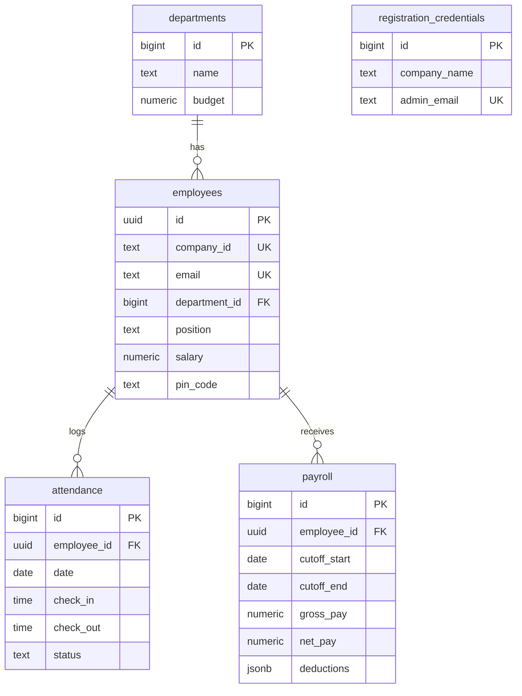

# Supabase Setup Guide

> Step-by-step guide to configure Supabase for Admin Pro's cloud sync, authentication, and backup.

---

## Table of Contents

1. [Create a Supabase Account](#1-create-a-supabase-account)
2. [Create a New Project](#2-create-a-new-project)
3. [Get Your API Credentials](#3-get-your-api-credentials)
4. [Configure Your `.env` File](#4-configure-your-env-file)
5. [Run the Database Schema](#5-run-the-database-schema)
6. [Enable Auth Providers](#6-enable-auth-providers)
7. [Schema Reference](#7-schema-reference)
8. [Verify Your Setup](#8-verify-your-setup)
9. [Troubleshooting](#9-troubleshooting)

---

## 1. Create a Supabase Account

1. Go to **[supabase.com](https://supabase.com)** and click **Start your project**.
2. Sign up using your **GitHub account** (recommended) or email.
3. After registration, you'll be taken to the Supabase Dashboard.

---

## 2. Create a New Project

1. From the Dashboard, click **New Project**.
2. Fill in the details:

   | Field              | Value                                       |
   |--------------------|---------------------------------------------|
   | **Organization**   | Select your org, or create a new one        |
   | **Project Name**   | `admin-pro` (or any name you prefer)        |
   | **Database Password** | A strong, unique password — **save this!** |
   | **Region**         | Choose the region closest to your users     |

3. Click **Create new project** and wait for provisioning (~2 minutes).

> [!IMPORTANT]
> **Save your database password** in a secure location. You'll need it if you ever connect to the database directly.

---

## 3. Get Your API Credentials

Once your project is ready:

1. Navigate to **Settings** → **API** (in the left sidebar).
2. Copy the following values:

   | Credential       | Where to Find It                  |
   |------------------|-----------------------------------|
   | **Project URL**  | Under `Project URL`               |
   | **Anon Key**     | Under `Project API keys` → `anon` / `public` |

> [!NOTE]
> The `anon` key is safe to use in the client. It only provides access that your Row Level Security (RLS) policies allow. **Never expose your `service_role` key** in the application.

---

## 4. Configure Your `.env` File

1. In the project root, copy the example file:
   ```bash
   cp .env.example .env
   ```
2. Open `.env` and paste your credentials:
   ```env
   # Supabase Configuration
   VITE_SUPABASE_URL=https://your-project-id.supabase.co
   VITE_SUPABASE_ANON_KEY=your-anon-key-here
   ```
3. **Save the file.** The application reads these at startup via `import.meta.env`.

> [!CAUTION]
> **Never commit your `.env` file to version control.** It is already included in `.gitignore`, but always double-check.

---

## 5. Run the Database Schema

Admin Pro requires a specific set of tables, policies, and triggers in your Supabase database. You have **two options** to set this up:

### Option A: Manual Schema (Recommended for First-Time Setup)

1. In your Supabase Dashboard, go to **SQL Editor** (left sidebar).
2. Click **New query**.
3. Open the file [`src/database/supabase_schema.sql`](../src/database/supabase_schema.sql) from this repository.
4. **Copy the entire contents** and paste them into the SQL Editor.
5. Click **Run** (or press `Ctrl+Enter`).
6. You should see a `Success. No rows returned` message — this is expected.

### Option B: RPC-Based Setup (For Programmatic Use)

This approach creates a stored function that the application can call:

1. In the **SQL Editor**, open and run [`src/database/setup_schema_rpc.sql`](../src/database/setup_schema_rpc.sql).
2. This creates a `setup_schema()` function that the app can invoke via `supabase.rpc('setup_schema')`.
3. The function runs with `SECURITY DEFINER` privileges, meaning it executes with the permissions of the database owner.

> [!WARNING]
> **Run the schema only once.** Both scripts use `CREATE TABLE IF NOT EXISTS`, so re-running is safe, but the policy drop/recreate operations reset all existing policies.

---

## 6. Enable Auth Providers

Admin Pro uses **Supabase Auth** for administrator login. Ensure email auth is enabled:

1. Go to **Authentication** → **Providers** in the Dashboard.
2. Verify that **Email** is **enabled** (it is by default).
3. Recommended settings:

   | Setting                          | Value       |
   |----------------------------------|-------------|
   | **Enable Email Signup**          | ✅ Enabled  |
   | **Confirm Email**                | ❌ Disabled (for local/desktop use) |
   | **Secure Email Change**          | ✅ Enabled  |
   | **Minimum Password Length**      | `8`         |

> [!TIP]
> For a desktop application, **disabling email confirmation** avoids the need for SMTP configuration. The first admin user is created via the app's initial setup flow with a developer setup key.

---

## 7. Schema Reference

The schema creates **5 tables** with full RLS, auto-updating timestamps, and foreign key relationships:

### Tables Overview



### Table Details

| Table                        | Primary Key        | Key Columns                                      |
|------------------------------|--------------------|--------------------------------------------------|
| `departments`                | `bigint` (identity)| `name`, `budget`                                 |
| `employees`                  | `uuid` (v4)        | `company_id`, `email`, `department_id` (FK)      |
| `attendance`                 | `bigint` (identity)| `employee_id` (FK), `date`, unique constraint    |
| `payroll`                    | `bigint` (identity)| `employee_id` (FK), `cutoff_start`, `cutoff_end` |
| `registration_credentials`   | `bigint` (identity)| `admin_email`, `license_key`                     |

### Row Level Security (RLS)

All tables have RLS **enabled**. A single policy is applied per table:

```sql
-- Applied to all 5 tables with the same pattern:
CREATE POLICY "auth_all_<table>" ON public.<table>
  FOR ALL
  USING (auth.role() = 'authenticated')
  WITH CHECK (auth.role() = 'authenticated');
```

This means **only authenticated users** can read, insert, update, or delete any rows. Unauthenticated requests are completely blocked.

### Auto-Updated Timestamps

Every table has a `created_at` and `updated_at` column. A trigger automatically updates `updated_at` on every row update:

```sql
CREATE TRIGGER handle_updated_at
  BEFORE UPDATE ON public.<table>
  FOR EACH ROW
  EXECUTE PROCEDURE public.handle_updated_at();
```

---

## 8. Verify Your Setup

After running the schema, verify everything is configured correctly:

### Check Tables

1. Go to **Table Editor** in the Supabase Dashboard.
2. Confirm these 5 tables exist:
   - `departments`
   - `employees`
   - `attendance`
   - `payroll`
   - `registration_credentials`

### Check RLS Policies

1. Go to **Authentication** → **Policies**.
2. Each table should show one policy: `auth_all_<tablename>`.

### Test the Application

1. Run the application:
   ```bash
   pnpm start
   ```
2. You should see the **Initial Setup** screen (if no admin exists yet).
3. Complete the admin registration — this creates your first Supabase Auth user and populates `registration_credentials`.

---

## 9. Troubleshooting

### "Supabase credentials missing" Error

- **Cause:** The `.env` file is missing or the variables are empty.
- **Fix:** Ensure `.env` exists in the project root with both `VITE_SUPABASE_URL` and `VITE_SUPABASE_ANON_KEY` set.

### "Permission denied" or "401 Unauthorized"

- **Cause:** RLS policies are blocking unauthenticated requests.
- **Fix:** Ensure you have run the schema SQL to create the correct policies. The app must authenticate via Supabase Auth before making data requests.

### Tables Not Appearing

- **Cause:** The schema SQL was not run or failed silently.
- **Fix:** Re-run `supabase_schema.sql` in the SQL Editor and check for error messages.

### "relation does not exist" Error

- **Cause:** Tables haven't been created yet or the schema was run in the wrong database/schema.
- **Fix:** Verify you're running the SQL in the correct project. Ensure the tables are in the `public` schema.

### Sync Not Working

- **Cause:** The app can't reach Supabase or the user is not authenticated.
- **Fix:**
  1. Verify internet connectivity.
  2. Check that the admin is logged in (the app uses the auth session for syncing).
  3. Review the developer console (`Ctrl+Shift+I`) for network errors.

### Packaged App Not Connecting

- **Cause:** Environment variables may not be bundled correctly in production.
- **Fix:** Ensure Vite is configured to inline `VITE_*` variables at build time. Check `forge.config.js` and `vite.main.config.mjs` for env handling.

---

## Additional Resources

- [Supabase Docs](https://supabase.com/docs) — Official documentation
- [Supabase Auth Guide](https://supabase.com/docs/guides/auth) — Authentication setup
- [RLS Deep Dive](https://supabase.com/docs/guides/auth/row-level-security) — Understanding Row Level Security
- [Supabase JavaScript Client](https://supabase.com/docs/reference/javascript/introduction) — Client library reference

---

> **Need help?** Open an issue on the [Admin Pro repository](https://github.com/carlodandan/admin-pro) or check the [Supabase Community Discord](https://discord.supabase.com).
