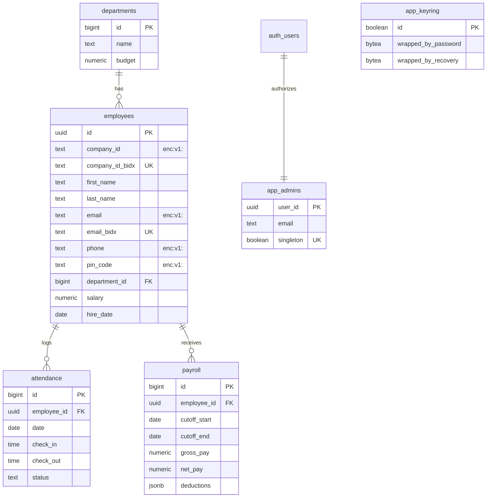

# Supabase Setup

> Creating the cloud project Admin Pro signs in against, applying the schema, and the two
> authentication settings registration depends on.

Admin Pro holds no credentials of its own. Supabase provides the administrator account, the
authorization decision, and custody of the wrapped encryption key — so this setup is a
prerequisite, not an optional cloud-backup feature.

---

## Contents

1. [Create the project](#1-create-the-project)
2. [Collect the API credentials](#2-collect-the-api-credentials)
3. [Configure `.env`](#3-configure-env)
4. [Apply the schema](#4-apply-the-schema)
5. [Configure authentication](#5-configure-authentication)
6. [Verify the setup](#6-verify-the-setup)
7. [Register the administrator](#7-register-the-administrator)
8. [Schema reference](#8-schema-reference)
9. [Making schema changes later](#9-making-schema-changes-later)
10. [Troubleshooting](#10-troubleshooting)

---

## 1. Create the project

1. Sign in at [supabase.com](https://supabase.com) and choose **New project**.
2. Fill in:

   | Field | Value |
   |---|---|
   | **Organization** | Yours, or a new one |
   | **Project Name** | `admin-pro`, or anything you prefer |
   | **Database Password** | Strong and unique — **save it** |
   | **Region** | Closest to your users |

3. Wait for provisioning (roughly two minutes).

> [!IMPORTANT]
> Store the database password in a password manager. It is unrelated to the Admin Pro
> administrator password, and you will need it for direct `psql` access.

## 2. Collect the API credentials

**Project Settings → API**:

| Credential | Where |
|---|---|
| **Project URL** | *Project URL* — `https://<ref>.supabase.co` |
| **Publishable / anon key** | *Project API keys* → `anon` / `public`, or a publishable `sb_publishable_…` key |

> [!CAUTION]
> Never put a `service_role` or secret key in `.env`. It bypasses RLS entirely, and `.env`
> values are compiled into the installer.

The `anon` key **is** extractable from a distributed installer, and that is accounted for: this
project grants `anon` nothing on any table, so the key authorizes nothing on its own. See
[`SECURITY.md`](SECURITY.md#the-anon-key-authorizes-nothing).

## 3. Configure `.env`

```bash
cp .env.example .env
```

```env
VITE_SUPABASE_URL=https://your-project-ref.supabase.co
VITE_SUPABASE_ANON_KEY=your-anon-or-publishable-key
```

Vite inlines both at build time. The Rust core reads the same two values — in `tauri dev` via
`dotenvy`, and in a release build as compile-time constants.

## 4. Apply the schema

**`supabase/migrations/` is the single source of truth for the cloud schema.** One migration
creates everything: the five data tables, the two credential tables, the authorization helper,
the three write RPCs, RLS on all seven tables, every policy, and the grants.

### Option A — SQL Editor (no tooling required)

1. Open **SQL Editor → New query** in the dashboard.
2. Paste the entire contents of
   [`supabase/migrations/20260905052457_cloud_credentials_and_keyring.sql`](../supabase/migrations/20260905052457_cloud_credentials_and_keyring.sql).
3. **Run**. `Success. No rows returned` is the expected result.

### Option B — Supabase CLI

```bash
supabase link --project-ref <your-project-ref>
supabase db push
supabase migration list          # confirm it is recorded remotely
```

Discover flags with `--help` rather than assuming them; the CLI's surface changes between
versions.

> [!NOTE]
> The migration is written to be re-runnable — `create table if not exists`,
> `create or replace function`, `drop policy if exists` before each `create policy`. Re-running
> it re-asserts the intended state and does not drop data.

### If you set this project up with an older version of Admin Pro

Earlier releases shipped `src/database/supabase_schema.sql` and
`src/database/setup_schema_rpc.sql`. **Both are deleted from the repository, and the second one
should be considered a live vulnerability wherever it was installed.** `setup_schema()` was
`SECURITY DEFINER`, lived in `public`, had `EXECUTE` granted to `anon`, and ran DDL as
`postgres` — meaning an unauthenticated caller holding only the anon key could reshape the
schema.

Applying this migration is the remediation: section 7 drops `setup_schema()`,
`check_admin_exists()` and `handle_updated_at()`, and sections 8–9 replace the old
`FOR ALL USING (auth.role() = 'authenticated')` policies with per-action policies gated on
`private.is_admin()`.

## 5. Configure authentication

**Authentication → Providers → Email** must be enabled (it is by default).

| Setting | Required value | Why |
|---|---|---|
| **Enable email signup** | ✅ On, at least until the first administrator is registered | Registration calls GoTrue `sign_up`. |
| **Confirm email** | ❌ **Off**, or configure custom SMTP | See below. |
| **Secure email change** | ✅ On | |
| **Minimum password length** | `8` or higher | The password is also the Argon2id passphrase that wraps the data key. |

> [!WARNING]
> **Email confirmation blocks registration on a default project.** Since 2024-09-26 Supabase's
> built-in SMTP only delivers to members of the project's organisation, so a confirmation mail
> to any other address is never sent. With confirmations on, `sign_up` returns no session,
> registration cannot obtain the JWT it needs for `claim_first_admin()` and `install_keyring()`,
> and the application reports that the account was created but could not be signed in.
>
> Either **turn Confirm email off** (appropriate for a single-administrator desktop
> application) or **configure custom SMTP** under *Authentication → Emails*.

Check the live setting without opening the dashboard:

```bash
curl -s "$VITE_SUPABASE_URL/auth/v1/settings" -H "apikey: $VITE_SUPABASE_ANON_KEY"
# mailer_autoconfirm: true  → confirmations are OFF, registration will work
```

> [!TIP]
> Once the administrator exists, consider turning **Enable email signup** off. Nothing an extra
> account could do is authorized — `claim_first_admin()` refuses a second admin — but disabling
> it removes the ability to create unused accounts at all.

## 6. Verify the setup

### Tables

**Table Editor** should list seven tables: `departments`, `employees`, `attendance`, `payroll`,
`registration_credentials`, `app_admins`, `app_keyring`.

### RLS and policies

Each of the five data tables should show four policies — `_select`, `_insert`, `_update`,
`_delete` — plus `app_admins_self_select` and `app_keyring_admin_select`. Confirm with:

```sql
select tablename, policyname, cmd
from pg_policies
where schemaname = 'public'
order by tablename, cmd;
```

`app_keyring` must have exactly one policy (`select`). It has no `insert`, `update` or `delete`
policy by design — the RPCs are its only write path.

### The anon key must be refused, not filtered

```bash
curl -s -o /dev/null -w '%{http_code}\n' \
  "$VITE_SUPABASE_URL/rest/v1/employees?select=id" \
  -H "apikey: $VITE_SUPABASE_ANON_KEY"
```

Expect **401** with `{"code":"42501","message":"permission denied for table employees"}`. A
`200` with `[]` means the grants did not apply — RLS is filtering rows rather than the table
being unreachable, which is a weaker position than intended.

### Advisors

Run the security and performance advisors (`supabase db advisors`, or the dashboard's
**Advisors** page). There must be **no `rls_disabled_in_public`** and **no
`function_search_path_mutable`**. Twelve warnings are expected and accounted for — see
[`SECURITY.md § Expected advisor findings`](SECURITY.md#expected-advisor-findings).

## 7. Register the administrator

With the schema applied and confirmations settled, launch the app:

```bash
pnpm start
```

The registration screen appears when `check_admin_exists_v2()` returns `false`. Completing it:

1. creates the GoTrue account,
2. inserts exactly one row into `app_admins` via `claim_first_admin()`,
3. generates the 32-byte data key,
4. uploads it wrapped twice via `install_keyring()`,
5. and displays the **64-character recovery key once**.

Copy the recovery key into a password manager before dismissing the screen. It is never stored
by the application or in either database, and it cannot be shown again.

Confirm afterwards:

```sql
select count(*) from public.app_admins;    -- 1
select count(*) from public.app_keyring;   -- 1
```

Both are capped at one row by constraint, so a second registration attempt fails in the
database rather than in the client.

## 8. Schema reference

### Relationships


```mermaid
erDiagram
    departments ||--o{ employees : "has"
    employees ||--o{ attendance : "logs"
    employees ||--o{ payroll : "receives"
    auth_users ||--|| app_admins : "authorizes"

    departments {
        bigint id PK
        text name
        numeric budget
    }
    employees {
        uuid id PK
        text company_id "enc:v1:"
        text company_id_bidx UK
        text first_name
        text last_name
        text email "enc:v1:"
        text email_bidx UK
        text phone "enc:v1:"
        text pin_code "enc:v1:"
        bigint department_id FK
        numeric salary
        date hire_date
    }
    attendance {
        bigint id PK
        uuid employee_id FK
        date date
        time check_in
        time check_out
        text status
    }
    payroll {
        bigint id PK
        uuid employee_id FK
        date cutoff_start
        date cutoff_end
        numeric gross_pay
        numeric net_pay
        jsonb deductions
    }
    app_admins {
        uuid user_id PK
        text email
        boolean singleton UK
    }
    app_keyring {
        boolean id PK
        bytea wrapped_by_password
        bytea wrapped_by_recovery
    }
```

### Tables

| Table | Key | Notes |
|---|---|---|
| `departments` | `bigint` identity | `name`, `budget`. |
| `employees` | `uuid` (`gen_random_uuid()`) | `company_id`, `email`, `phone`, `pin_code` are `enc:v1:…` ciphertext. Uniqueness is carried by `email_bidx` / `company_id_bidx`. |
| `attendance` | `bigint` identity | `unique (employee_id, date)`. |
| `payroll` | `bigint` identity | `unique (employee_id, cutoff_start, cutoff_end)`; `deductions jsonb`. |
| `registration_credentials` | `bigint` identity | Company and administrator **profile only**. There is deliberately no password-hash column — GoTrue owns credentials. |
| `app_admins` | `user_id uuid` → `auth.users` | `singleton boolean` uniquely indexed ⇒ at most one row, ever. |
| `app_keyring` | `id boolean check (id)` | Exactly one row. Two wrapped copies of the data key, each `salt(16) ‖ nonce(12) ‖ ct+tag`. |

Employee ciphertext columns are plain `text`. Uniqueness lives on the `*_bidx` columns because a
`UNIQUE` constraint on randomly-nonced ciphertext enforces nothing — see
[`SECURITY.md § Blind indexes`](SECURITY.md#blind-indexes).

### Functions

| Function | Caller | Purpose |
|---|---|---|
| `private.is_admin()` | `authenticated` | The single authorization predicate. `security definer`, `set search_path = ''`, in a non-exposed schema. |
| `public.claim_first_admin()` | `authenticated` | Inserts `auth.uid()` into `app_admins` while it is empty. Second call: *"an administrator is already registered for this project"*. |
| `public.install_keyring(text, text)` | `authenticated` admin | Inserts the single keyring row. Second call: *"the encryption key has already been generated for this project"*. |
| `public.rewrap_password(text)` | `authenticated` admin | Replaces `wrapped_by_password` only, leaving the recovery escrow intact. |
| `public.check_admin_exists_v2()` | `anon`, `authenticated` | Returns one boolean so the app can choose between the registration and sign-in screens before anyone signs in. The only `anon`-callable function. |

The two `install_keyring` / `rewrap_password` arguments are `text` holding **standard**-alphabet
base64, not `bytea`. That is deliberate: the write never depends on PostgREST's `bytea` input
parsing, and Postgres `decode(…, 'base64')` expects the standard alphabet. (`enc:v1:` field
payloads use the URL-safe alphabet — the two are not interchangeable.)

### Policies and grants

Every table has RLS enabled and one policy **per action** — never `FOR ALL`. `UPDATE` policies
carry both `USING` and `WITH CHECK`. `anon` has `revoke all` on every table. `authenticated`
holds full DML on the five data tables and **`SELECT` only** on `app_admins` and `app_keyring`.
The rationale for each of those choices is in
[`SECURITY.md § Cloud access control`](SECURITY.md#cloud-access-control).

### No `updated_at` triggers

Earlier versions installed a `handle_updated_at()` `BEFORE UPDATE` trigger on every table. This
schema deliberately has none, and the migration drops it: local is authoritative and pushes its
own `updated_at`, which the sync engine then reads back as a receipt. A trigger would rewrite
that value and every row would look permanently unsynced. See
[`ARCHITECTURE.md § One-way sync`](ARCHITECTURE.md#one-way-sync).

## 9. Making schema changes later

1. Iterate with `execute_sql` (MCP) or `supabase db query` — neither writes a migration-history
   entry, so a mistake costs a correction rather than a stuck history.
2. Run the advisors and fix what they flag.
3. Create the migration file — `supabase migration new <descriptive_name>` — and paste the
   final SQL in. Never invent a filename.
4. Apply it (`supabase db push`) and confirm with `supabase migration list`.
5. Commit the file. `supabase/migrations/` is version-controlled; `supabase/.branches/`,
   `supabase/.temp/` and `supabase/.env` are ignored.

**Never edit a migration that has already been applied**, and never use `apply_migration` to
iterate — it records history on every call.

If the change touches employee columns, mirror it in `src-tauri/src/db/schema.rs` **and** add an
additive step to `src-tauri/src/db/migrations.rs`, or existing installs will diverge.

## 10. Troubleshooting

### "Supabase credentials missing"

`.env` is absent or a value is empty. Both `VITE_SUPABASE_URL` and `VITE_SUPABASE_ANON_KEY` must
be set in the project root **before** building, since they are inlined at build time. Rebuild
after editing `.env` — restarting a packaged binary will not pick up a change.

### "The administrator account was created but could not be signed in"

Email confirmation is on and the confirmation mail was never delivered. See
[section 5](#5-configure-authentication). The GoTrue account now exists, so either confirm the
address, or turn confirmations off and sign in with the same credentials — the registration flow
resumes from there.

### `permission denied for table …` while signed in

Either the migration did not run (no grants) or the signed-in user has no `app_admins` row:

```sql
select * from public.app_admins;
select private.is_admin();     -- run as the signed-in user, not as postgres
```

If `app_admins` is empty, no administrator was ever claimed — register through the app.

### An update reports success but changes nothing

A `SELECT` policy is missing on that table. Postgres must read a row before it can update it,
and without a `SELECT` policy the update affects zero rows and raises no error. Re-apply the
migration.

### "the encryption key has already been generated for this project"

`app_keyring` already holds its one row. This is the intended refusal. If you are re-provisioning
deliberately and no encrypted data matters, delete the row and the `app_admins` row, then
register again — **every existing `enc:v1:` value becomes permanently unreadable**, in both
databases.

### "Incorrect password or recovery key."

The Argon2id unwrap failed its AEAD tag check. There is no stored hash to compare against, so
this single message covers a wrong password, a mistyped recovery key, and a corrupt blob. Check
`length(wrapped_by_password) = 76`; anything else means the blob is damaged.

### Sync appears to do nothing

Check, in order:

1. Is there an active session? `sync_all` returns immediately without one.
2. Are rows genuinely unchanged? A row whose cloud `updated_at` exactly matches the local value
   is skipped as already mirrored — that is correct behaviour, not a failure.
3. Are you expecting cloud → local? **It does not happen.** After the first-run seed, sync is
   one-way. Confirm with `select value from app_meta where key = 'seeded'` locally.

The Rust core logs each pass with a `[Sync]` prefix; run `pnpm start` from a terminal to see it.

### A packaged build cannot reach Supabase

The `VITE_*` values were empty at build time. Confirm the CI secrets are set (see
[`GITHUB_WORKFLOW.md`](GITHUB_WORKFLOW.md)) and rebuild — there is no runtime configuration file
to correct after the fact.

### Anything else

Fetch Supabase's
[Monitoring and Debugging guide](https://supabase.com/docs/guides/monitoring-and-debugging) and
check the project logs before changing code. Most PostgREST and GoTrue failures are diagnosable
from the request log alone.

---

## Further reading

- [Supabase docs](https://supabase.com/docs)
- [Row Level Security](https://supabase.com/docs/guides/database/postgres/row-level-security)
- [Securing your API](https://supabase.com/docs/guides/api/securing-your-api)
- [Product security](https://supabase.com/docs/guides/security/product-security)
- [`SECURITY.md`](SECURITY.md) — why this schema is shaped the way it is
